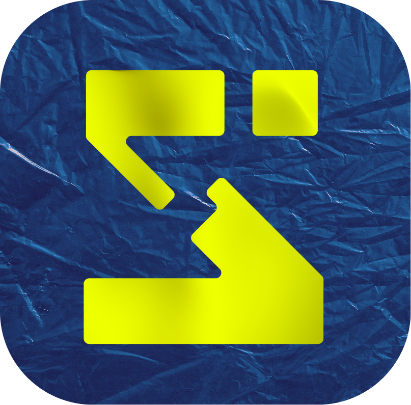

<div align="center">



# Mindtero

**A visual thinking layer for your local Zotero library.**

Spatial boards, typed relations, quote cards and PDF page snapshots —
 Zotero stays your database; Mindtero owns the graph overlay and never
 writes anything back (strict read-only).

</div>

## What is Mindtero?

Mindtero is a **local, offline-first mind-map canvas on top of your Zotero library**:

- **Browse** your Zotero collections, tags and full-text search (local HTTP API,
  read-only — Mindtero *never* writes to Zotero).
- **Compose**: drag items from the library onto a board, or `Ctrl/Cmd+K` anywhere.
- **Relate**: connect cards and pick relation kinds (supports / contradicts /
  extends / cites / method / context …) — colour and dash encode the meaning.
- **Expand**: grow the graph from any item — Zotero "related" items, authors,
  tags, collections, neighbours sharing tags, and **PDF highlights** pulled from
  the annotations of its attached PDFs (with checkboxes: you pick the highlights,
  not all of them).
- **Quote cards & page snaps**: turn annotations into quote cards, or render any
  PDF *page* as an image card.
- **Arrange**: dagre auto-layout (top-down / left-right / grid), resizable frames
  to bundle nodes under a tag.
- **Protect**: a view-only mode that prevents any structural change — nothing can
  be deleted by accident.
- **Backup**: export/import single boards or whole-backup JSON; in the desktop
  shell an autosave flushes all boards into your Documents folder every few
  seconds.

## stacks

| Layer | Choice |
| --- | --- |
| Build | Vite 8 + React 19 + TypeScript (strict) |
| Styling | Tailwind CSS v4, shadcn/ui (radix base) |
| Canvas | @xyflow/react (React Flow 12) |
| Layout | @dagrejs/dagre |
| State | TanStack Query v5 + Zustand (IndexedDB via idb-keyval) |
| Routing | React Router 7 · Validation Zod 4 |
| Desktop | Electron (local-only shell + built-in `/zotero-api` proxy) |
| Tests | Vitest + Testing Library |

## Getting started

```bash
npm install
npm run dev      # browser app on http://localhost:5273 (dev proxy included)
npm run lint     # oxlint
npm test         # vitest (run via: npx vitest run)
npm run electron:dev   # desktop shell (serves the built app)
npm run electron:build # build + launch
```

**Make sure Zotero is reachable**: in Zotero, enable *Settings → Advanced →
“Allow other applications on this computer to communicate with Zotero”*, and in
the advanced config editor set the boolean
`extensions.zotero.httpServer.localAPI.enabled = true` (then restart Zotero).
No API key needed — mindtero only speaks `GET`.

## Releases

Versions are managed automatically: every push to `main` bumps the patch
version, pushes a git tag (`vX.Y.Z`) and publishes a GitHub Release with a
built bundle attached. All builds are gated to exactly this repository
(`if: github.repository == …`), so nobody can fork-and-patch a release from a
fork.

## License

MIT
